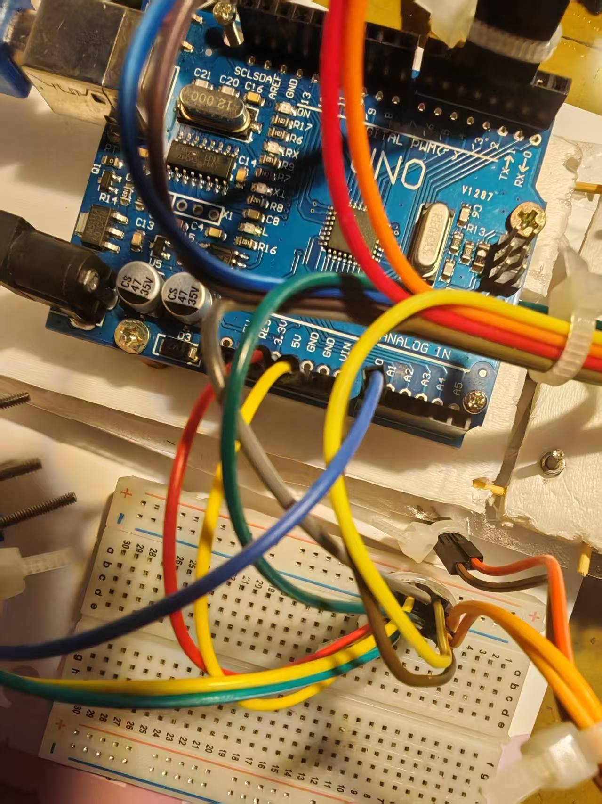
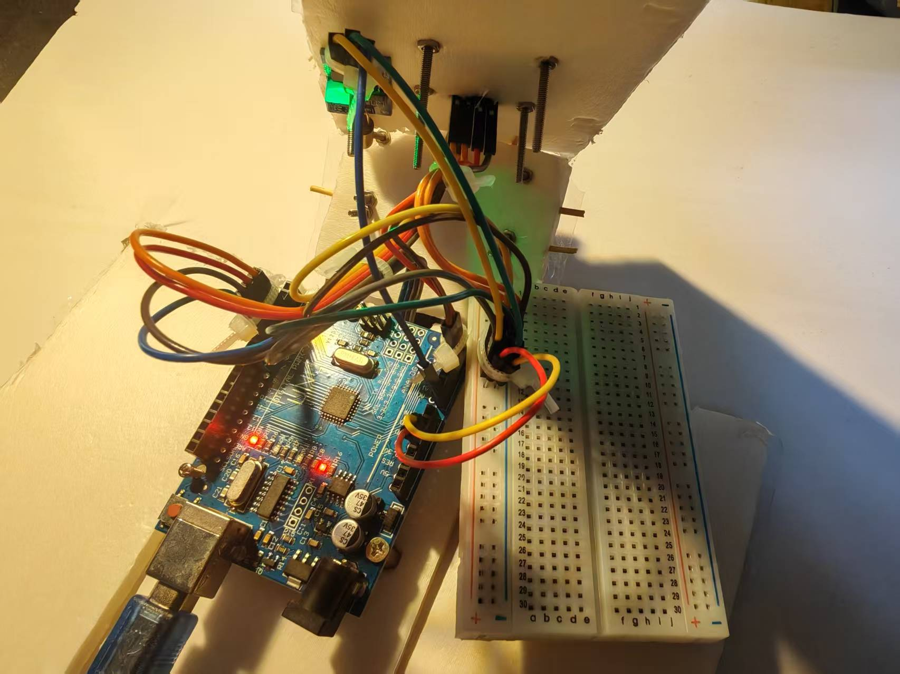
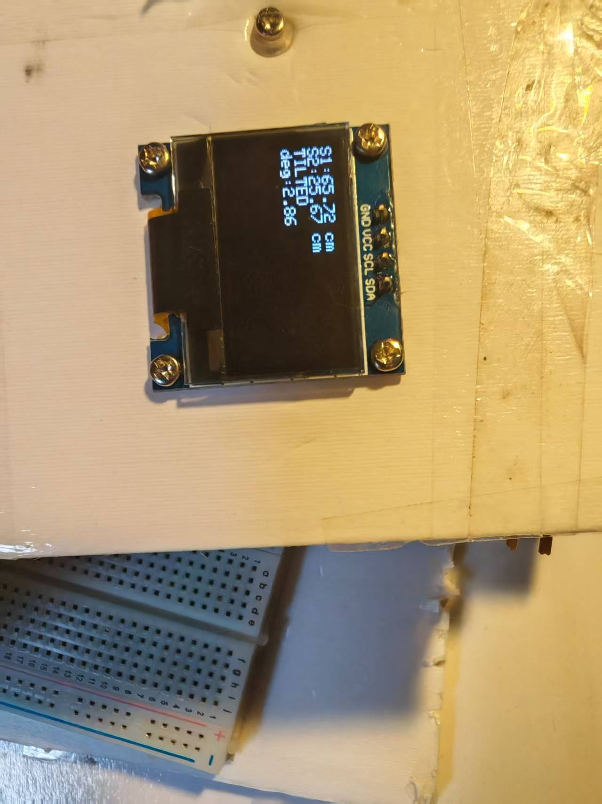
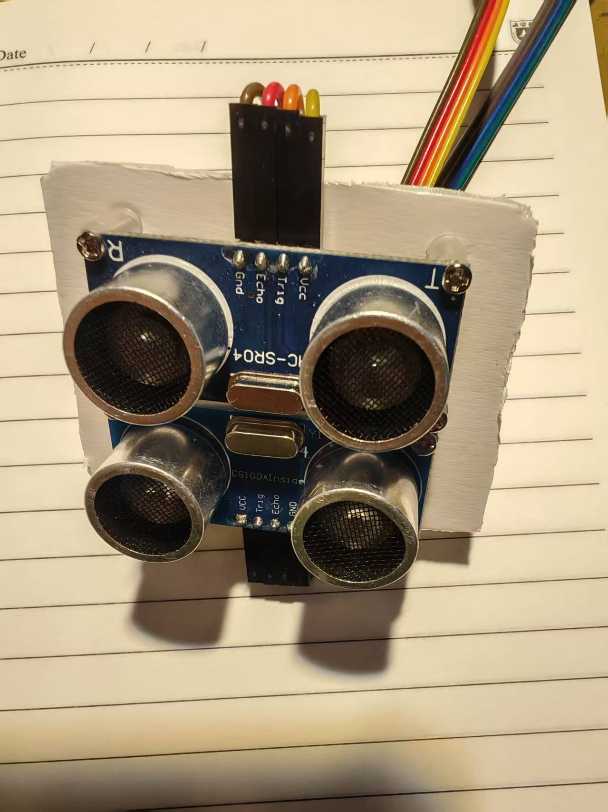

#Project--01-Arduino-Based-Slope-and-Distance-Measuring-Instrument#
  该项目基于Ardiuno Uno R3开发板,通过简单计算实现。
**所需器材：Ardiuno Uno R3 开发板*1，HC-SR04超声波传感器*2，oled屏*1，倾斜传感器*1，面包板*1，杜邦线若干，螺丝若干，kt板**
--制作流程：
1.接线：
| 模块         | Arduino 引脚    |
| ---------- | ------------- |
| 超声波 1 Trig | D2            |
| 超声波 1 Echo | D3            |
| 超声波 2 Trig | D4            |
| 超声波 2 Echo | D5            |
| 倾斜传感器      | A0（+5V 和 GND） |
| OLED SDA   | A4            |
| OLED SCL   | A5            |
| OLED VCC   | 5V            |
| OLED GND   | GND           |
因为开发板上GND和5.5v插口数量有限，所以供电线可以插在面包板上，即GND对应负极，VCC对应正极（5.5v）.

2.编译：
先将开发板通过数据线连接到电脑，然后打开Ardiuno IDE,在工具栏中选择对应开发板以及端口。
输入代码，点击——>写入板中。
3.最终效果：
     deg表示角度，即坡度；
     S1，S2分别表示上下两个测距传感器测出的距离，即距离；
     "LEVEL" 或 "TILTED"表示是否水平，当然，为了更准确，理论上应该使用两个倾斜传感器，应为两条相交的线才能确定一个平面以及其是否平行于其他平面，读者可自行添加。
    效果图：

